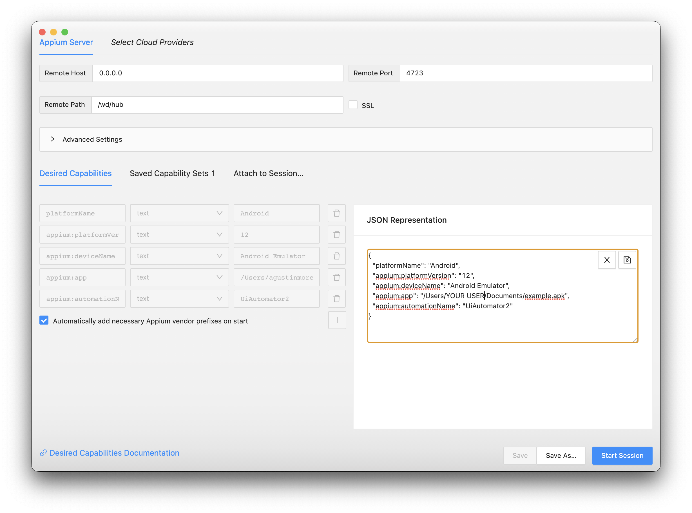
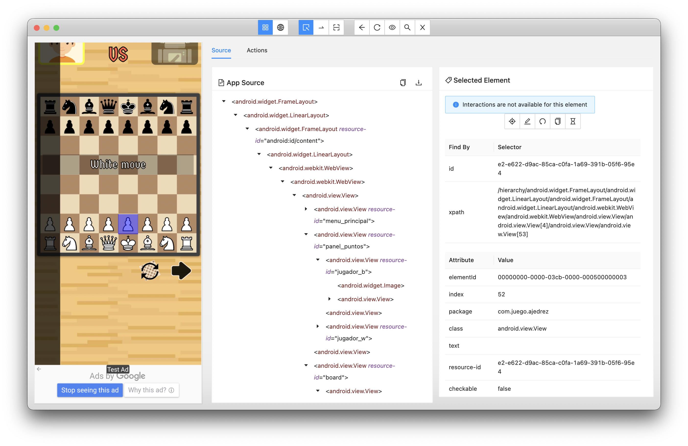

<div align="center">
  <h1>
    <br/>
    🍭
    <br />
    <br />
    Appium WebdriverIO Tuto
    <br />
    <br />
  </h1>
  <sup>
    <br />
 Appium WebdriverIO Starter Boilerplate for NodeJS, test your mobile apps with ease!</em>
    <br />
    <br /

[](https://github.com/morellexf26/appium-webdriverio-tuto/releases)
[](https://github.com/morellexf26/appium-webdriverio-tuto/blob/main/LICENSE)
[](https://www.npmjs.com/package/appium-webdriverio-tuto)
[](https://vuejs.org)

  </sup>
</div>

<br>

❗️ This guide is mainly intended to be used as an Android User.

## ✨ Pre-requisites
- Install Node (https://nodejs.org/en/download/)
- Install Java (https://www.java.com/en/)
- Setup `ANDROID_HOME` & `JAVA_HOME`
- Install Android Studio (If you want to test using an emulator)

    *In order to get your app selectors I recommend you to:

- Install Appium Desktop version, it can be found [here](https://github.com/appium/appium-desktop/releases/). 

    Make sure that both host & port are configured as you can see in the image bellow.
    


    Why not the terminal version? because this one is easier to configure and you will have a better way to see what is happening while the app is running 😊

- Install Appium Inspector, it can be found [here](https://github.com/appium/appium-inspector/releases).

    1. Open the application you've just installed.
    2. Type `0.0.0.0` in Remote Host.
    3. Type `4723` in Remote Port.
    4. Type '/wd/hub' in Remote Path.
    5. Configure your "Desired Capabilities":
        There are tons of options but you only need this to start.
        ```json
        {
            "platformName": "Android", // or iOS
            "appium:platformVersion": "12",
            "appium:deviceName": "Android Emulator",
            "appium:app": "{PATH TO APK OR IPA FILE}",
            "appium:automationName": "UiAutomator2" // Default option 
        }
        ```
        Read more about desired capabilities [here](https://github.com/appium/appium/blob/master/docs/en/writing-running-appium/caps.md).

        

You're almost done, at this point you just need to run Appium Desktop by clicking the "startServer" button and then go to the Appium Inspector application and click the "Start session" button. Now that your session has started you will see your application at the left and elements TREE at the right. Click an element to see the selectors to use in your tests.
Always try to set accessibility ids! 🫡 



<br>

## 🚀 Install & Run boilerplate

Install it locally and run in easy steps

```bash
npm install
npm test
```
